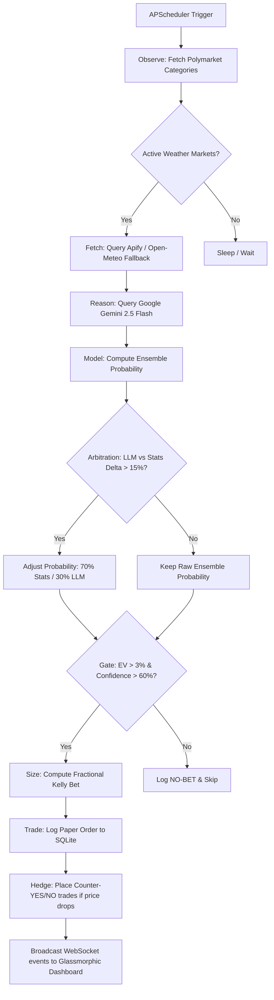

# ⚡ Aeolus: Prediction Weather AI Agent

Autonomous weather research and prediction market arbitrage trading agent built on a custom Aeolus-style reasoning loop. It fetches global and local weather data, builds probabilistic ensemble forecasts, sizes trades using the fractional Kelly Criterion, places paper trades, hedges portfolio variance, and exposes a real-time glassmorphic monitoring dashboard.

---

## 🚀 Key Features

*   **Aeolus Reasoning Loop:** Implements the full `OBSERVE` ➔ `FETCH` ➔ `REASON` ➔ `MODEL` ➔ `GATE` ➔ `SIZE` ➔ `TRADE` ➔ `HEDGE` loop.
*   **Ensemble Forecasting Model:** Synthesizes Numerical Weather Predictions (NWP), historical climate baselines, and LLM soft-priors with an active calibration layer.
*   **Kelly Risk Engine:** Operates on fractional (half-Kelly) bet sizing with strict hard caps (5% max exposure per trade, 15% daily loss limits, and city correlation limits).
*   **Adaptive Hedging:** Dynamically triggers counter-positions when forecast probabilities shift, locking in partial profits or mitigating drawdowns.
*   **Resilient API Fallback:** If Apify API limits are hit, the fetcher automatically query-routes to the free **Open-Meteo API** (requiring no token/key) to maintain continuous live weather data streams.
*   **Interactive Glassmorphism Dashboard:** Real-time web dashboard displaying bankroll curve, live positions, historical predictions, city coverage matrix, and streaming reasoning logs.

---

## 📊 System Architecture



---

## 📁 Project Structure

```
cwt-weather-agent/
├── agent/
│   ├── core.py              # Aeolus reasoning loop & Gemini API client
│   ├── prompts.py           # System & user prompt templates
│   └── scheduler.py         # Async job scheduling & contract resolution
├── data/
│   ├── fetcher.py           # Apify & Open-Meteo fallback weather clients
│   ├── polymarket.py        # Polymarket REST API connector
│   └── normalizer.py        # Weather payload normalization
├── model/
│   └── forecast.py          # Ensemble model & WMO code mappings
├── risk/
│   ├── kelly.py             # Fractional Kelly stake sizing
│   └── hedge.py             # Correlation caps & counter-hedging triggers
├── db/
│   ├── models.py            # SQLAlchemy database schemas
│   ├── migrations.py        # Schema init & mock data seeders
│   └── queries.py           # Database transaction helpers
├── api/
│   ├── main.py              # FastAPI server entry point & endpoints
│   └── ws.py                # WebSocket client broadcaster
├── ui/
│   └── index.html           # Single-page glassmorphic frontend
├── notifications/
│   └── telegram.py          # Telegram alert router
├── tests/                   # Pytest suite
│   ├── test_forecast.py
│   ├── test_kelly.py
│   └── test_agent.py
├── config.py                # Configuration load, limits, & thresholds
├── main.py                  # Server bootstrap script
├── requirements.txt         # Python package manifest
├── Dockerfile               # Container build instructions
└── docker-compose.yml       # Multi-service setup
```

---

## 🛠️ Installation & Setup

### Prerequisites
*   Python 3.11+
*   Git

### 1. Clone & Install
```bash
git clone https://github.com/yashj808/Aeolus.git
cd Aeolus
pip install -r requirements.txt
```

### 2. Environment Configuration
Create a `.env` file in the root directory:
```env
PORT=8000
DATABASE_URL=sqlite:///weather_agent.db
INITIAL_BANKROLL=1000.0
RUN_INTERVAL_HOURS=4

# Set to "false" to run live integrations; "true" to simulate local runs
MOCK_MODE=false

# Google Gemini API Settings (Rate limited to 15 Req/Min)
# Obtain key at: https://aistudio.google.com/
GEMINI_API_KEY=your_gemini_api_key_here
GEMINI_MODEL=gemini-2.5-flash

# Apify Scraper Token (Optional: fallbacks to Open-Meteo if empty/exceeded)
APIFY_TOKEN=your_apify_token_here

# Polymarket API URLs & Sizing parameters
POLYMARKET_CLOB_URL=https://clob.polymarket.com
POLYMARKET_GAMMA_URL=https://gamma-api.polymarket.com
POLYMARKET_MIN_VOLUME_USD=500

# Telegram notifications (Optional)
TELEGRAM_ENABLED=false
TELEGRAM_BOT_TOKEN=your_bot_token_here
TELEGRAM_CHAT_ID=your_chat_id_here
```

### 3. Run Locally
```bash
python main.py
```
Open [http://localhost:8000](http://localhost:8000) in your browser.

---

## 🐳 Docker Deployment

To spin up the server and agent scheduler in a containerized environment:

```bash
docker-compose up --build
```
The dashboard will be served at [http://localhost:8000](http://localhost:8000).

---

## 🧪 Running Tests

We implement unit tests using `pytest` and `pytest-asyncio` covering forecast extraction, Kelly sizing, and mock agent cycles:

```bash
pytest tests/
```

---

## 📊 Core Algorithms

### 1. Forecast Probability Ensemble
```
P_model = 0.5 * P_nwp + 0.3 * P_hist + 0.2 * P_llm
```
If the discrepancy between the LLM prior (`P_llm`) and the statistical consensus (`0.5 * P_nwp + 0.3 * P_hist`) exceeds `15%`, the arbitration rule balances the output to limit hallucinations:
```
P_final = 0.70 * P_statistical + 0.30 * P_llm
```

### 2. Kelly Criterion Sizing
We implement the fractional variant of the Kelly formula to compute the stake amount:
```
f* = (p - price) / (1 - price)
f_fractional = f* * KELLY_FRACTION (0.5)
f_final = min(f_fractional, MAX_BET_PCT (5%))
```
Where `p` is the model's winning probability and `price` represents the contract price of the side being purchased.
If `EV < 3%` or LLM `confidence < 60%`, the trade is rejected (NO-BET).

### 3. Deterioration Hedging
If an active YES position's winning probability drops below `(1 - current_price) * 0.9`, the hedge engine places a NO contract (limit 30% of parent stake) to lock in partial profits or cap losses.
